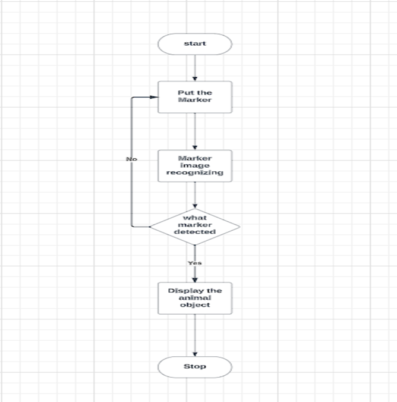
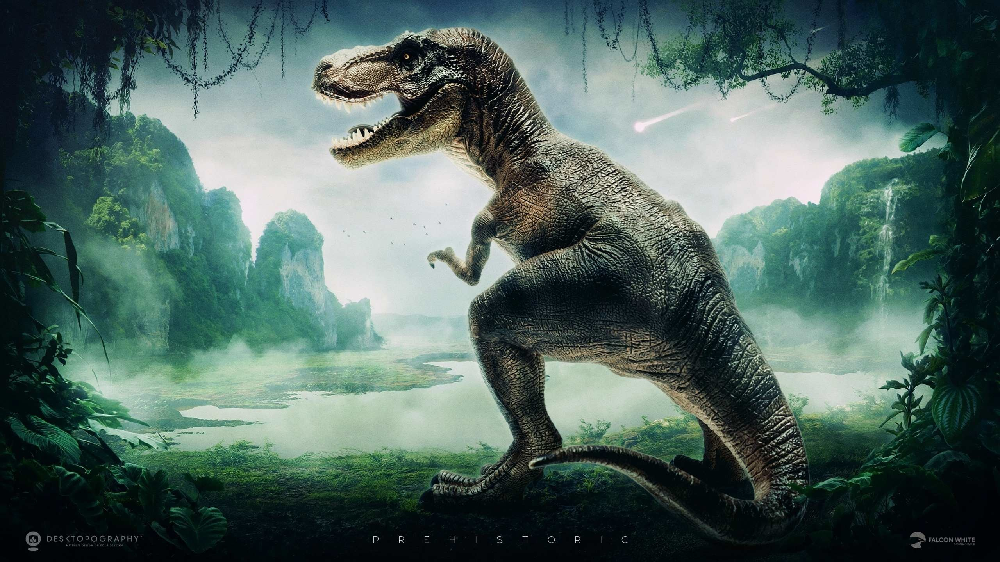
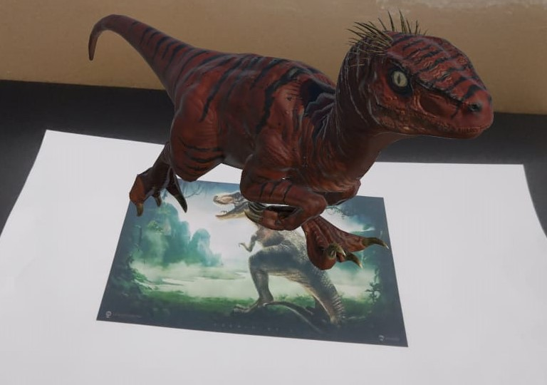
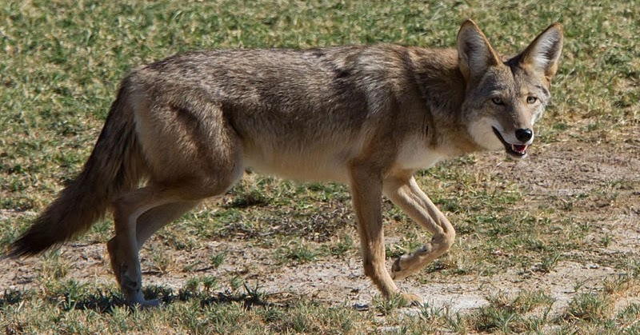
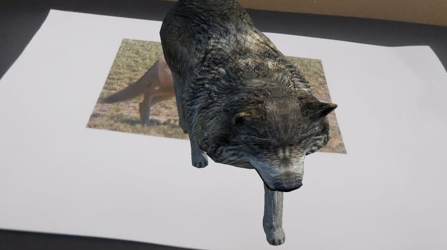

# Augmented-reality-for-Extinct-Animals
The Aim of the project is to develop an Android-based application that showcases endangered and extinct species in three dimensions using augmented reality (AR).
## Features
1. Bring extinct species to life using augmented reality.
2. Offer interactive learning experiences to enhance understanding
3. Ensure compatibility with various Android devices for broad accessibility
4.  Educate the public about extinct species to raise awareness.

## Requirements
 
 1. Unity(latest version) for project development.
 2. VUFORIA QUALCOMM(latest version) installation for project development.

## Flow chart
[](https://github.com/SudharshnaLakshmi/Augmented-reality-for-Extinct-Animals/blob/main/FLOWCHART.png)
## Installation
  ### 1.Clone the repository:
  ```
   https://github.com/SudharshnaLakshmi/Augmented-reality-for-Extinct-Animals.git
  ```
  ### 2.Install the required packages
  
  1. Unity package
  2. VUFORIA QUALCOMM package
  
    
## Usage:

1.The application uses a marker card of two extinct animal to recognize and track the position of the user's smartphone.
2.Once the marker card is detected, the application loads the corresponding 3D model of the animal.
3.The application uses the smartphone's camera to track the position and orientation of the marker card.
4.The application then renders the 3D model of the animal onto the smartphone's display, aligned with the position and orientation of the marker card.
5.The user can then interact with the 3D model of the animal by moving their smartphone around.

## Program:
```
using System.Collections;
using System.Collections.Generic;
using UnityEngine;

public class animalcontroller : MonoBehaviour
{
    public GameObject animal1;
    public GameObject animal2;

    bool isleftPressed;
    bool isrightPressed;
    bool isforwardPressed;

    // Start is called before the first frame update
    void Start()
    {
        isleftPressed = false;
        isrightPressed = false;
        isforwardPressed = false;
    }
    public void OnleftPressed()
    {
        isleftPressed = true;
    }
    public void OnleftReleased()
    {
        isleftPressed = false;
    }
    public void OnrightPressed()
    {
        isrightPressed = true;
    }
    public void OnrightReleased()
    {
        isrightPressed = false;
    }
    public void OnforwardPressed()
    {
        isforwardPressed = true;
    }
    public void OnforwardReleased()
    {
        isforwardPressed = false;
    }
    // Update is called once per frame
    void Update()
    {
        if (isleftPressed == true)
        {
            animal1.transform.Rotate(new Vector3(0f, 45f, 0f) * Time.deltaTime);
            animal2.transform.Rotate(new Vector3(0f, 45f, 0f) * Time.deltaTime);
        }
        if (isrightPressed == true)
        {
            animal1.transform.Rotate(new Vector3(0f, -45f, 0f) * Time.deltaTime);
            animal2.transform.Rotate(new Vector3(0f, -45f, 0f) * Time.deltaTime);
        }
        if (isforwardPressed == true)
        {
            animal1.transform.Translate(new Vector3(0f, 0f, -3f) * Time.deltaTime, Space.Self);
            animal2.transform.Translate(new Vector3(0f, 0f, 3f) * Time.deltaTime, Space.Self);

        }

    }

}
```
## Output:
### Marker 1:



### AR image of Marker1:



### Marker 2:



### AR image of Marker2:



## Result:

  The project successfully developed an Android-based application that utilizes augmented reality (AR) to bring extinct species to life in 3D.
    1.It gives you an Engaging AR Experience
    2.User-Friendly Design
    3.Immersive 3D experience and engaging content can make learning about extinct species more enjoyable and memorable.
  Thus the project has successfully developed an innovative and impactful application that utilizes AR technology to educate and inspire individuals about the importance of extinct species.

